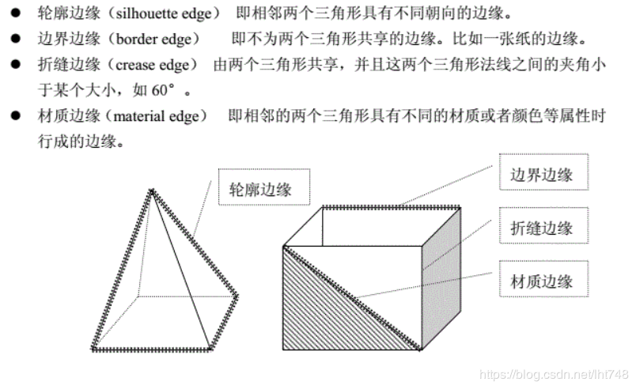
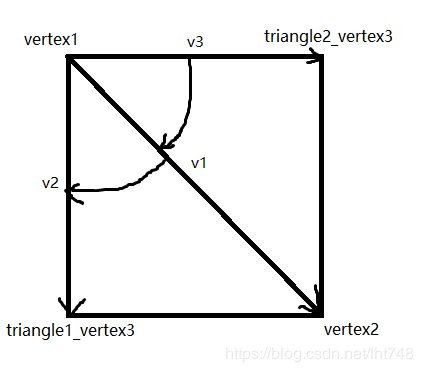
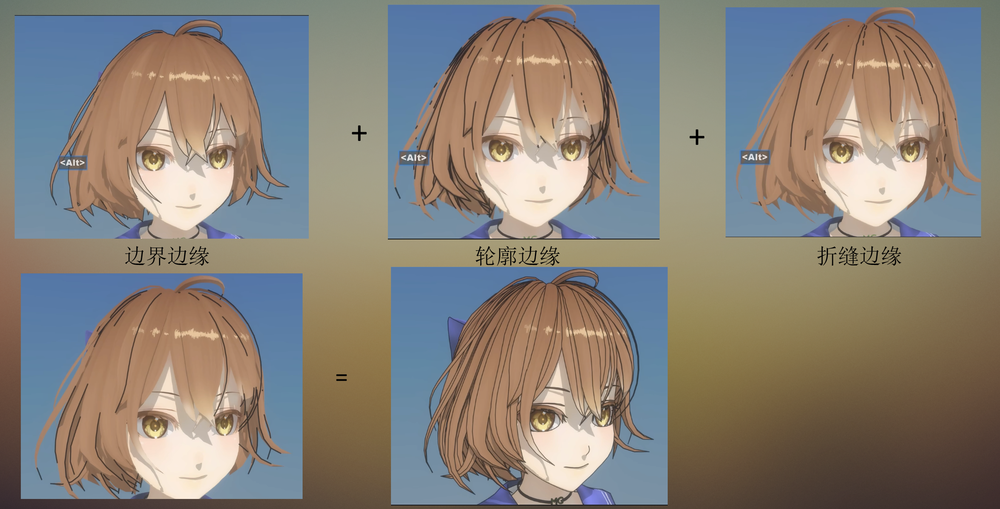
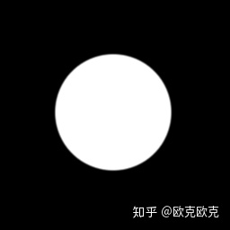
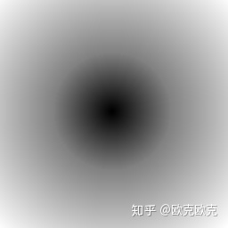
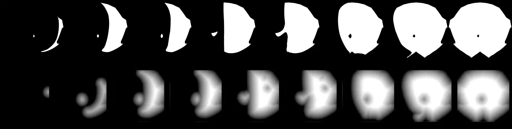
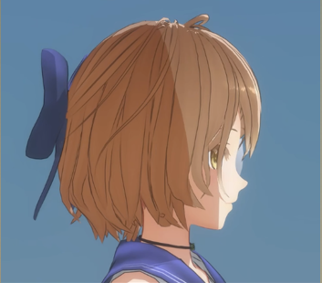
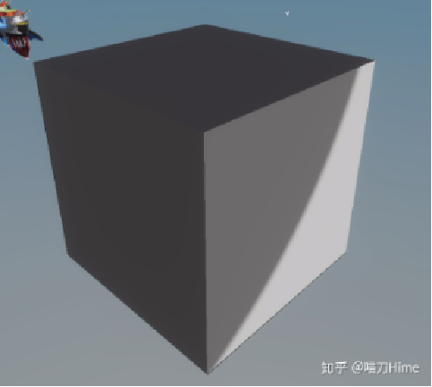
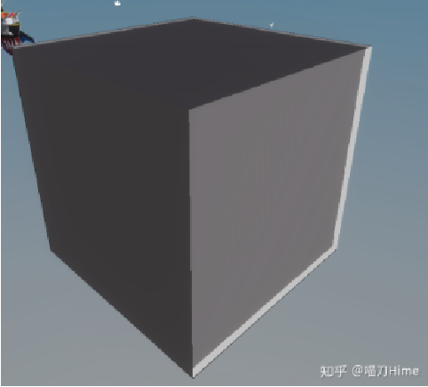
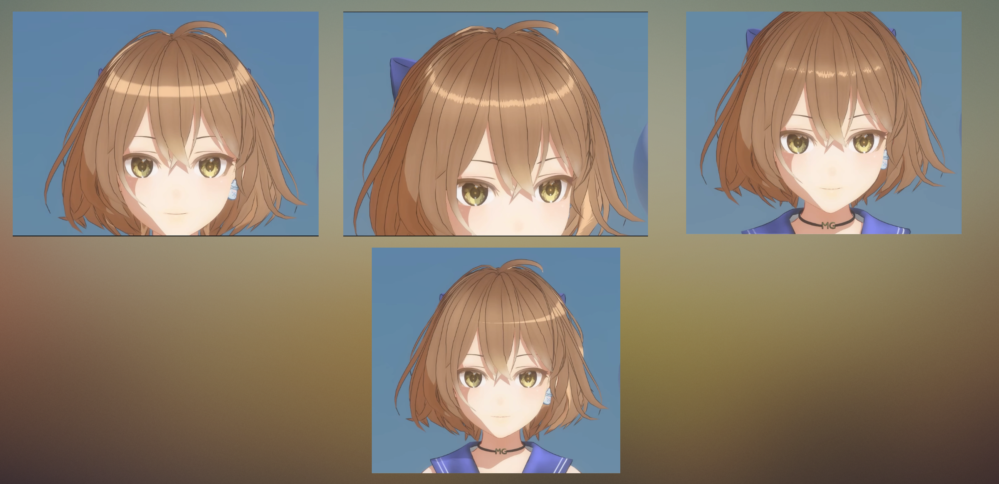

## 卡通渲染：


先看看效果：


视频效果：[2024技术美术暑假实习生作品集_哔哩哔哩bilibili](https://www.bilibili.com/video/BV11x4y1P7YM/)

### 描边：

**1.基于观察角度和表面法线的轮廓线渲染：**

​	基于观察角度和表面法线的轮廓线渲染。这种方法使用视角方向和表面法线的点乘结果来得到轮廓线的信息。这种方法简单快速，可以在一个 Pass中就得到渲染结果，但局限性很大，很多模型渲染出来的描边效果都不尽如人意。可以用模型法线修改工具自定义描边。

**2.过程式几何轮廓线渲染。**

​	过程式几何轮廓线渲染。这种方法的核心是使用两个 Pass渲染。第一个 Pass渲染背面的面片，并使用某些技术让它的轮廓可见;第二个 Pass再正常渲染正面的面片。这种方法的优点在于快速有效，并且适用于绝大多数表面平滑的模型，但它的缺点是不适合类似于立方体这样平整的模型。

.PNG)

​												如果是个cube的话，就把每个顶点法线变成邻接三个面法线的平均

**实现方法：**

​	这套方案通过Unity开放的AssetPostprocessor接口实现在导入模型时直接修改导入结果，导入模型时读取Mesh的数据并用最新的Job system进行多线程并行计算，实测可以在4-5秒内生成3W面任意类型模型描边所需法线，并烘焙存入顶点色RG通道，剩下的B、A通道用来控制Z Offset和宽度。

​	首先是法线相关，本文对法线的操作包括：读取到某Mesh某个顶点上的原法线 N ，再读取到利用Unity内置导入功能平滑后的同一顶点法线 N′ ，将 N′ 利用TBN矩阵（Tangent，Bitangent，Normal）的转置转换到切线空间，并存入顶点色，此操作等同于平时常见的烘焙法线贴图。之后在Shader中利用世界空间下的TBN矩阵将烘焙的 N′ 转换到世界空间下得到平滑的Outline Normal。

**3.基于图像处理的轮廓线渲染（卷积）**

​	同样难以风格化，而质量上的提升需要依赖美术，比如蓝色协议用顶点色卷积实现细节上的描边，性能高且与画面复杂度无关，也很适合蓝色协议这种MMO的性能要求。这些日厂所使用的**后处理、顶点色、本村线**，可能已经是目前三渲二游戏中描边的最佳方案了，并且非常依赖美术，尤其是本村线，因其制作成本极高而基本不见使用。

**4.基于轮廓边检测的轮廓线渲染**

​	基于轮廓边检测的轮廓线渲染。上面提到的各种方法，一个最大的问题是，无法控制轮廓线的风格渲染。对于一些情况，我们希望可以渲染出独特风格的轮廓线，例如水墨风格等。为此，我们希望可以检测出精确的轮廓边，然后直接渲染它们。检测一条边是否是轮廓边的公式很简单，我们只需要检查和这条边相邻的两个三角面片是否满足以下条件:

​															（N0 * V > 0）≠ (N1 * V > 0)

**5.基于退化四边形的实时描边(使用边缘检测算法)**

​		3D模型描边有两种方式，一种是基于图像，即在所有3D模型渲染完成一张图片后，对这张图片进行边缘检测，最后得出描边效果。一种是基于空间，即针对3D模型的三角面三个顶点构成的线条做边缘检测（注：和基于图像的边缘检测的检测方式是不同的，但都叫边缘检测）。在本文中使用的是基于空间的3D模型的描边。

空间的3D模型的描边的边是有类型的，大致总结有4种：轮廓边、边界边、折缝边、材质边。



轮廓边的检测根据定义就是，1条边的2个邻接面的法线分别和视线方向的点乘结果再相乘，结果小于0就是轮廓边。数学上表达就是：(N1·V)*(N2·V) < 0，N1和N2是2个邻接面的法向量，V是视线方向。

边界边的检测比较简单，如果1条边只有1个面邻接，那么这条边就是边界边。

折缝边的检测需要使用1个角度参数α，1条边的2个邻接面的夹角和这个参数做大小比较。一般在0~180度，但本文选择在0~90度，并规定小于参数α的就是折缝边。

总结：要在3D模型上实现这3类边的绘制，只需要知道构成1条边的2个邻接面即可完成3类边的检测。在学术上有人把这2个邻接面当做1个点输入到着色器中，并作为1条边作为输出，并称这2个邻接面为退化四边形。



由于不同的图形引擎，对图形接口的高级用法支持程度并不一致，例如Unity3D的几何着色器就没办法获取邻接三角形。因此必须进行预处理。

**实现步骤：**

步骤1：预处理阶段，在这个阶段找出模型所有的边，以及边所对应的2个邻接面（默认所有边都是由2个邻接面相交构成，不规范的请自行处理）。

步骤2：把预处理阶段的数据保存下来，Uinty3D提供了很好接口ScriptableObject 。（注：默认保存退化四边形4个顶点的索引，如果保存的不是顶点索引，请自行处理）

步骤3：通过CommandBuffer、ComputeBuffer把预处理据输入到显卡（GPU）中，每帧都所有退化四边形进行边的检测和绘制。

 

**shader中边缘检测步骤：**

步骤1：通过退化四边形4个顶点数据，计算出2个邻接面的法向量。如果顶点数不足4个则表明该边只有1个邻接面，因此它是边界边。

步骤2：计算出2个邻接面的法向量和视线方向的点乘结果dot(N1, V) * dot(N2, V)，如果结果为负则是轮廓边。

步骤3：pow(dot(N1, N2) / cos(α), 2)在[0, PI/2]上单调递增, 可避免开方的特点，完成和dot(N1, N1) * dot(N2, N2)比较，如果小于则为折缝边。

**效果：**



### 球面化面部阴影：

面部阴影（根据脸部法线进行计算）

1. **罪恶装备----逐顶点的画法线（阴影的形状好看，但是过度非常僵硬，容易发生跳变）**
2. **将脸的法线映射成球形**
3. **定义一个点，在脸部的局部坐标中，从这个点开始，到脸部的每一个顶点的方向作为它的法线方向**
4. **通过有向距离场（SDF）制作脸部阴影**，这种方法的思路就是使用距离场记录光照数据，之后在根据光源方向取出对应的阴影形状，它的优势很明显可以完全自定义阴影形态，同时在不同形态之间拥有自然的过渡。

**signed distance field**，中文名为有向距离场，SDF有2D和3D的区别，它的定义非常简单：每个像素（体素）记录自己与距离自己最近物体之间的距离，如果在物体内，则距离为负，正好在物体边界上则为0。



我们规定白色表示为物体，黑色表示为空，那么这样一副中间一个圆的图像，其对应的SDF图应该就是这样：



为了图片显示，将有向距离值映射到了[0-1]范围，0.5表示物体内外的分界线。可以清楚看到，位于圆中心的点是最黑的，因为它处于物体最内部，而图片的四个角最白，因为它们距离圆最远。

**SDF生成算法**：

公式：**MinimumSDF(near.sdf + distance(now,near))**

near表示附近像素点，now表示当前像素，near.sdf表示near的SDF值，distance表示两点之间距离。

```伪代码
now.sdf = 999999;
if(now in object){
    now.sdf = 0;
}else{
    foreach(near in nearPixel(now)){
        now.sdf = min(now.sdf,near.sdf + distance(now,near));
    }
}
```

**思路：**

1.首先遍历一遍图像，将物体内和物体外的点标记出来，这里有两个gird，因为是有向距离场，分别计算物体外到物体的距离，以及物体内部的点到物体外的距离

2.grid的计算方法就是找目标点及左上方四个点中，SDF最小的值。PASS1就是按照从上到下，从左到右的顺序，遍历整个图像，遍历完成之后，对于所有物体外的点，如果距离它最近的物体是在它的左上方，那么它的SDF值就已确定。类似的，PASS2就是按照从下到上，从右到左的顺序，依次比较右下方的四个点，遍历完成之后，对于所有物体外的点，如果距离它最近的物体是在它的右下方，那么它的SDF也已经确定了。两个PASS结合，那么整个图像的SDF就都计算出来了。

3.俩个grid就是计算物体内部到外部的距离。因为一个点要么在物体内要么在物体外，所以两次的SDF值要么全为零（在边界上），要么一个为0，一个为距离值。用：grid1(pixel).sdf - grid2(pixel).sdf就能得到完整的SDF。



大概过程是先绘制出不同光照角度的面部阴影形状，之后使用算法生成每张光照图的SDF，插值混合生成最终图像。

有了距离场贴图之后，计算时主要需要三个数据，面部向前的向量(forward)，面部向左的向量(left)和光照向量(L)。lightAtten确定了当前光照在距离场贴图中的位置。而left与L点积确定光照方向在面部左边还是右边。要注意的是，距离场贴图实际记录了单方向光照，所以计算另一方向的光照时需要翻转采样。

```
float3 lightDirH = normalize(float3(L.x, 0, L.z));

float lightAtten = 1 - (dot(lightDirH, forward) * 0.5 + 0.5);
float filpU = sign(dot(lightDirH, left));
float3 shaodwRamp = tex2D(_ShaodwRamp, input.uv * flaot2(filpU, 1));

float faceShadow = step(lightAtten, shaodwRamp.r);
```

## 边缘光：

**屏幕空间深度边缘光 Screen Space Depth Rimlight**

原理：取当前像素屏幕UV，向某一方向偏移后采样深度，与当前像素深度进行比较，深度差大于某一阈值则为边缘。

1.对深度纹理进行采样以获得当前像素的深度 

2.计算水平方向和垂直方向的深度差 dx、dy 

3.使用深度差和阈值计算深度边缘照明 

4.对主纹理进行采样并应用边缘照明

```
// 对深度纹理进行采样以获得当前像素的深度
   float depth = tex2D(_DepthTex, i.uv).r;

// 计算水平方向和垂直方向的深度差 dx、dy
   float dx = tex2D(_DepthTex, i.uv + float2(_EdgeWidth, 0)).r - depth;
   float dy = tex2D(_DepthTex, i.uv + float2(0, _EdgeWidth)).r - depth;

// 使用深度差和阈值计算深度边缘照明
   float edgeLighting = step(_DepthThreshold, abs(dx)) * step(_DepthThreshold, abs(dy));
```





传统边缘光由于主要使用物体表面法线的向量和相机的视线向量之间的夹角计算，在硬表面上是这样的



屏幕空间方法则可以取得较好的效果

## 头发球面化切线各向异性高光

I_spec (各向异性高光强度) = K_s(高光颜色) * [N(法线向量) • H(半角向量)] * [T(切线向量) • H(半角向量)]^p(反光度参数)

- `p`：反光度参数，决定高光锐利程度，值越大，高光越锐利
- `(N • H)`：表示法线`N`与半角向量`H`的点积，用于计算基本的高光强度
- `(T • H)^p`：表示切线`T`与半角向量`H`的点积的`p`次幂，用于计算各向异性高光的衰减



